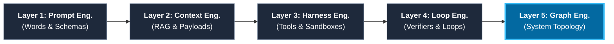
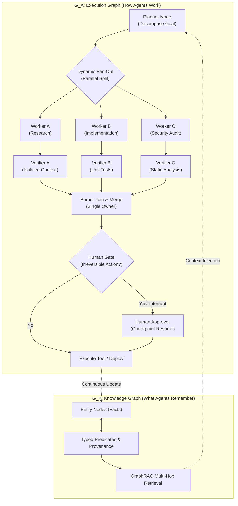
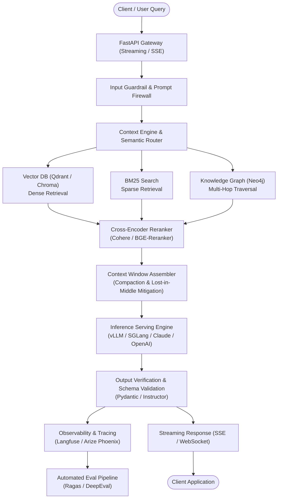
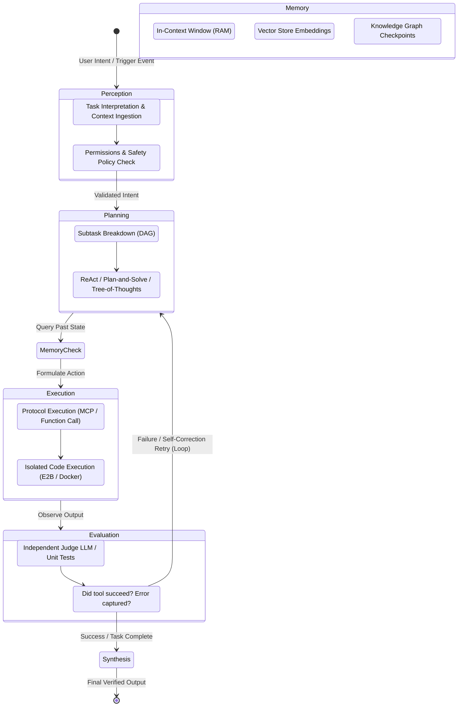
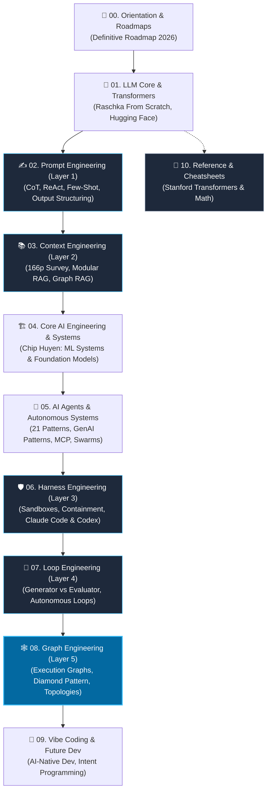

<div align="center">

# 📚 The Definitive AI Engineer Roadmap & Production Bookshelf (2026 Edition)
### *A Curated Digital Library of 35+ Production AI Engineering Books, Research Papers & System Topologies*

[](https://github.com/topics/awesome)
[](LICENSE)
[](https://github.com)
[](#the-10-stage-learning-path)
[](#)

**[Books Catalog](#in-depth-book-literature-catalog) • [Featured Books](#featured-books-quick-matrix) • [Directory Structure](#bookshelf-directory-structure) • [Reading Tracks](#curated-reading-implementation-tracks) • [Roadmap PDF](00-Roadmaps-and-Guides/The-Definitive-AI-Engineer-Roadmap-2026.pdf)**

</div>

---

> 📖 **Welcome to the AI Engineer Bookshelf (2026 Edition)**  
> A curated digital library of **35+ production-grade books, engineering guides, and Stanford cheatsheets** for developers transitioning from **traditional software engineering → modern AI & Agentic Systems**.
> Includes the official 12-page **[Definitive AI Engineer Roadmap 2026 (PDF)](00-Roadmaps-and-Guides/The-Definitive-AI-Engineer-Roadmap-2026.pdf)** as a hands-on reading and capstone guide.

### 💡 Why This Repository Exists
Most AI learning roadmaps bury software engineers under academic theory—deriving linear regression proofs, decision trees, or outdated classical ML tutorials. 

In production, **AI Engineering is systems engineering**. You treat models as non-deterministic reasoning engines and build deterministic software around them:
- **LLM Core**: Tokenization, attention mechanics, KV cache memory, quantization (GGUF/AWQ).
- **Context & RAG**: Semantic chunking, hybrid search (Dense + BM25), cross-encoder reranking, and GraphRAG.
- **Microservices**: Low-latency SSE streaming with FastAPI, Redis semantic caching, LiteLLM routing, and Langfuse tracing.
- **Autonomous Agents**: ReAct loops, Model Context Protocol (MCP), tool call validation, and memory hierarchies.
- **Harness & Loop Engineering**: Docker/E2B containment, bash firewalls, and Generator vs. Evaluator separation.
- **Execution Graphs**: Stateful DAGs, LangGraph checkpointers, Diamond verification patterns, and human-in-the-loop gates.

### 🎓 Who Is This For?
- **Backend & Full-Stack Developers**: Moving from standard CRUD APIs to streaming LLM services and RAG pipelines.
- **Software Engineers Transitioning to AI**: Skipping academic math derivations to focus on architecture, evaluation, and latency.
- **Tech Leads & Architects**: Designing multi-agent platforms, sandboxed execution harnesses, and production governance.  
*(Prerequisites: Working Python proficiency, basic familiarity with REST/HTTP APIs, and standard software engineering practices).*

---

## 📑 Table of Contents
- [🎯 How AI Engineering Evolved (2022 – 2026)](#how-ai-engineering-evolved-2022-2026)
  - [The 3 Structural Phases of This Bookshelf](#the-3-structural-phases-of-this-bookshelf)
- [🗂️ Bookshelf Directory Structure](#bookshelf-directory-structure)
- [⭐ Featured Books & Quick Matrix](#featured-books-quick-matrix)
- [🔬 The 5 Cumulative Engineering Layers](#the-5-cumulative-engineering-layers)
- [📐 Visual Architecture Diagrams](#visual-architecture-diagrams)
  - [1. The 5-Layer AI Engineering Continuum](#1-the-5-layer-ai-engineering-continuum)
  - [2. Graph Engineering & Execution Topologies](#2-graph-engineering-execution-topologies)
  - [3. Production Context-Aware AI System Architecture](#3-production-context-aware-ai-system-architecture)
  - [4. Autonomous Agent Cognitive Loop](#4-autonomous-agent-cognitive-loop)
- [🗺️ The 10-Stage Learning Path](#the-10-stage-learning-path)
- [🎯 Curated Reading & Implementation Tracks](#curated-reading-implementation-tracks)
  - [Track 1: The Production AI Systems Engineer](#track-1-the-production-ai-systems-engineer-core-track)
  - [Track 2: The 2026 Agentic Architect (The 5 Evolution Layers)](#track-2-the-2026-agentic-architect-the-5-evolution-layers)
  - [Track 3: Harness Engineering & Vibe Coding](#track-3-harness-engineering-vibe-coding-next-gen-developer)
- [📚 In-Depth Book & Literature Catalog](#in-depth-book-literature-catalog)
  - [00. Roadmaps, Guides & Cheat Sheets](#00-roadmaps-guides-cheat-sheets)
  - [01. LLM Foundations & Transformers](#01-llm-foundations-transformers)
  - [02. Prompt Engineering (Layer 1)](#02-prompt-engineering-layer-1)
  - [03. Context Engineering (Layer 2)](#03-context-engineering-layer-2)
  - [04. AI Engineering, Systems & LLMOps](#04-ai-engineering-systems-llmops)
  - [05. AI Agents & Autonomous Systems](#05-ai-agents-autonomous-systems)
  - [06. Harness Engineering (Layer 3)](#06-harness-engineering-layer-3)
  - [07. Loop Engineering (Layer 4)](#07-loop-engineering-layer-4)
  - [08. Graph Engineering & System Intelligence (Layer 5)](#08-graph-engineering-system-intelligence-layer-5-2026-frontier)
  - [09. Vibe Coding & AI-Assisted Development](#09-vibe-coding-ai-assisted-development)
  - [10. Reference & Cheatsheets](#10-reference-cheatsheets)
- [🌐 Essential Open-Source Ecosystem & GitHub Repositories](#essential-open-source-ecosystem-github-repositories)
- [🛠️ Recommended Hands-On Capstone Projects](#recommended-hands-on-capstone-projects)
- [👥 Top Communities, Newsletters & Interview Prep](#top-communities-newsletters-interview-prep)
- [💡 Core Engineering Principles](#core-engineering-principles-build-as-you-read)
- [🤝 Contributing & Community Support](#contributing-community-support)

---

## 🎯 How AI Engineering Evolved (2022 – 2026)

In 2022, building with AI meant tweaking prompts. Today, building with AI means engineering distributed software systems around foundation models:

```text
2022 - 2023 : Prompt Engineering   ──▶ Words, system instructions, few-shot schemas
2023 - 2024 : Context Engineering  ──▶ Context budgets, embeddings, hybrid RAG, payload compaction
2024 - 2025 : Harness Engineering  ──▶ Docker/E2B sandboxes, bash firewalls, tool permission models
2025 - 2026 : Loop Engineering     ──▶ Generator vs. Evaluator separation, automated test-gate self-healing
2026+       : Graph Engineering    ──▶ Multi-agent execution topologies (DAGs, Diamond pattern, stategraphs)
```

The model weights are just the reasoning engine. As an AI Engineer, your primary leverage is designing the **containment, context pipelines, and verification topologies** that make non-deterministic models reliable enough for production.

### 🏛️ The 3 Structural Phases of This Bookshelf

```text
┌────────────────────────────────────────────────────────────────────────┐
│ 📍 PHASE 1: GENERATIVE AI & FOUNDATION SYSTEMS (Folders 00 - 04)       │
│    Master the model internals, linguistic steering, RAG, and APIs.     │
│    [00 Roadmaps] ──▶ [01 LLM Core] ──▶ [02 Prompt] ──▶ [03 Context/RAG] ──▶ [04 FastAPI/LLMOps]
└──────────────────────────────────┬─────────────────────────────────────┘
                                   │
                                   ▼
┌────────────────────────────────────────────────────────────────────────┐
│ 🤖 PHASE 2: AGENTIC AI & SYSTEM INTELLIGENCE (Folders 05 - 08)         │
│    From autonomous agents to sandboxed harnesses and execution graphs. │
│    [05 Agents Core] ──▶ [06 Sandboxed Harness] ──▶ [07 Evaluator Loop] ──▶ [08 Multi-Agent Graph]
└──────────────────────────────────┬─────────────────────────────────────┘
                                   │
                                   ▼
┌────────────────────────────────────────────────────────────────────────┐
│ 🚀 PHASE 3: AI-NATIVE DEVELOPER EXPERIENCE & REFERENCE (09 - 10)       │
│    Modern intent programming, Claude Code workflows & Stanford cheats. │
│    [09 Vibe Coding / AI-Native Dev]  ──▶  [10 Stanford Cheatsheets]    │
└────────────────────────────────────────────────────────────────────────┘
```

---

## 🗂️ Bookshelf Directory Structure

The collection is organized into **11 sequentially numbered folders (00–10)** precisely reflecting the modern learning and architectural progression:

```text
.
├── 📍 PHASE 1: Generative AI & Foundation Systems (Folders 00 - 04)
│   ├── 00-Roadmaps-and-Guides/                  # The Definitive AI Engineer Roadmap (12p Master PDF + Markdown)
│   ├── 01-LLM-Foundations-and-Transformers/     # 3 Books (Sebastian Raschka From Scratch, Hugging Face Transformers, Musiol GenAI)
│   ├── 02-Prompt-Engineering/                   # 2 Books (843p O'Reilly guide + Practical LEGO Techniques) [Layer 1]
│   ├── 03-Context-Engineering/                  # 3 Works (Lingrui Mei et al. 166p Survey + LangChain + Graph RAG) [Layer 2]
│   └── 04-AI-Engineering-and-System-Design/     # 8 Books — 🔑 Chip Huyen x2, FastAPI | 📎 SLMs, K8s, Scratch, Guidebook, LLMOps
│
├── 🤖 PHASE 2: Agentic AI & System Topologies (Folders 05 - 08)
│   ├── 05-AI-Agents-and-Autonomous-Systems/     # 8 Works — 🔑 Koenigstein, 21 Patterns, Lakshmanan | 📎 ADAS, Illustrated, Dummies
│   ├── 06-Harness-Engineering/                  # 4 Works (Claude Code Guide, Harness Guide, Design Guide, Codex Philosophies) [Layer 3]
│   ├── 07-Loop-Engineering/                     # 5 Works + BAIR Manifesto (Loop Eng, LLM-as-Judge, OpenAI, Anthropic CAI, Self-Refine) [Layer 4]
│   └── 08-Graph-Engineering-and-System-Intelligence/ # 3 Definitive Works (Engineering Agent Graphs, Field Guide, arXiv Survey) [Layer 5]
│
├── 🚀 PHASE 3: Developer Experience & Quick Reference (Folders 09 - 10)
│   ├── 09-Vibe-Coding-and-AI-Assisted-Dev/      # 3 Works (Gene Kim & Yegge EN, Beyond Vibe Coding, Wasi)
│   └── 10-Reference-and-Cheatsheets/            # 3 Cheatsheets (Stanford Transformers, Agentic Design Architecture, AI Agents)
└── README.md
```

---

## ⭐ Featured Books & Quick Matrix

For rapid navigation, here is a curated matrix of must-read books and primary resources in this repository:

| Folder | Title & Author | Focus Area | Level | Direct Link |
|:---|:---|:---|:---|:---|
| `00` | **The Definitive AI Engineer Roadmap (2026)** | Unified 10-stage curriculum, milestones & interview Q&A | All Levels | [Open Folder](00-Roadmaps-and-Guides/) |
| `01` | **Build a Large Language Model (from Scratch)**<br/>*Sebastian Raschka* | LLM architecture, PyTorch weights, self-attention | Intermediate | [Open Folder](01-LLM-Foundations-and-Transformers/) |
| `01` | **Natural Language Processing with Transformers**<br/>*Lewis Tunstall, Leandro von Werra, Thomas Wolf* | Hugging Face ecosystem, tokenizers, fine-tuning | Intermediate | [Open Folder](01-LLM-Foundations-and-Transformers/) |
| `02` | **Prompt Engineering for Generative AI**<br/>*James Phoenix & Mike Taylor (O'Reilly, 843p)* | Reasoning prompting, ReAct, schema synthesis | All Levels | [Open Folder](02-Prompt-Engineering/) |
| `03` | **Context Engineering for Large Language Models**<br/>*Lingrui Mei et al. (166p Survey)* | RAG payloads, semantic chunking, Graph RAG | Advanced | [Open Folder](03-Context-Engineering/) |
| `04` | **Designing Machine Learning Systems** & **AI Engineering**<br/>*Chip Huyen* | Production LLMOps, data pipelines, systems design | Advanced | [Open Folder](04-AI-Engineering-and-System-Design/) |
| `04` | **Building Generative AI Services with FastAPI**<br/>*Alireza Parandeh* | Streaming SSE APIs, Docker, microservices | Intermediate | [Open Folder](04-AI-Engineering-and-System-Design/) |
| `05` | **AI Agents: The Definitive Guide**<br/>*Nicole Koenigstein* | Agent loops, tool usage, enterprise architecture | Advanced | [Open Folder](05-AI-Agents-and-Autonomous-Systems/) |
| `05` | **21 Design Patterns for Generative AI**<br/>*EECS UC Berkeley* | Industry multi-agent & LLM patterns | Intermediate | [Open Folder](05-AI-Agents-and-Autonomous-Systems/) |
| `06` | **Harness Engineering Guide**<br/>*HuaShu* | Sandboxes (Docker/E2B), OS isolation, security | Lead / Architect | [Open Folder](06-Harness-Engineering/) |
| `07` | **Loop Engineering: Continuous Feedback**<br/>*AI Systems Research* | Generator vs Evaluator, stopping conditions | Lead / Architect | [Open Folder](07-Loop-Engineering/) |
| `08` | **Engineering Agent Graphs & System Intelligence**<br/>*Frontier Research (2026)* | Execution graphs (G_A), Diamond pattern, state reducers | Frontier | [Open Folder](08-Graph-Engineering-and-System-Intelligence/) |
| `09` | **Vibe Coding: AI-Assisted Development**<br/>*Gene Kim & Steve Yegge* | Intent programming, Claude Code, AI workflows | All Levels | [Open Folder](09-Vibe-Coding-and-AI-Assisted-Dev/) |
| `10` | **Stanford CS229 Cheatsheet: Transformers & LLMs**<br/>*Afshine Amidi & Shervine Amidi (Stanford)* | Attention math, RoPE, KV cache reference | Quick Ref | [Open Folder](10-Reference-and-Cheatsheets/) |

---

## 🔬 The 5 Cumulative Engineering Layers

The five evolutionary layers are cumulative, not a ladder one discards:

1. **Layer 1: Prompt Engineering (2022&ndash;2023)**
   - *Primary Work*: System instructions, few-shot exemplars, structured schemas (Pydantic/JSON), and Chain-of-Thought reasoning.
   - *Failure Mode*: Model hallucinations, semantic drift, non-deterministic phrasing.
2. **Layer 2: Context Engineering (2023&ndash;2024)**
   - *Primary Work*: Information payload optimization, dense/sparse hybrid retrieval (RAG), semantic chunking, context window packing, and long-sequence processing.
   - *Failure Mode*: "Lost-in-the-middle" degradation, context pollution, out-of-budget token blowouts.
3. **Layer 3: Harness Engineering (2024&ndash;2025)**
   - *Primary Work*: The containment infrastructure surrounding the model. Isolated tool sandboxes (Docker/E2B), OS bash firewalls, parameter validation, and session persistence (Claude Code / Codex architectures).
   - *Failure Mode*: Prompt injection escape, destructive tool execution, environment corruption.
4. **Layer 4: Loop Engineering (2025&ndash;2026)**
   - *Primary Work*: Continuous feedback loops (Plan &rarr; Act &rarr; Verify &rarr; Fix). The generator vs. evaluator separation (an AI cannot grade its own code), self-healing test gates, and explicit stopping conditions.
   - *Failure Mode*: Infinite retry loops, self-justifying rationalization, runaway token expenditures.
5. **Layer 5: Graph Engineering (2026 Frontier)**
   - *Primary Work*: Multi-agent execution topologies (G_A), knowledge memory graphs (G_K), eliminating fake edges, diamond task patterns (isolated verifiers), dynamic fan-out/join, and durable checkpointer states.
   - *Failure Mode*: State drift, uncoordinated consensus error explosion (17.2x), costume graphs for sequential tasks.

---

## 📐 Visual Architecture Diagrams

### 1. The 5-Layer AI Engineering Continuum



---

### 2. Graph Engineering & Execution Topologies



---

### 3. Production Context-Aware AI System Architecture



---

### 4. Autonomous Agent Cognitive Loop



---

## 🗺️ The 10-Stage Learning Path



---

## 🎯 Curated Reading & Implementation Tracks

### 🌟 Track 1: The Production AI Systems Engineer (Core Track)
*Target: Building reliable, cost-efficient, low-latency LLM and RAG systems for enterprise production.*
1. `00-Roadmaps-and-Guides/The-Definitive-AI-Engineer-Roadmap-2026.pdf` *(Official Master Curriculum)*
2. `10-Reference-and-Cheatsheets/Stanford Cheatsheet - Transformers and Large Language Models.pdf`
3. `01-LLM-Foundations-and-Transformers/[Manning] Build a Large Language Model (From Scratch).pdf` *(Sebastian Raschka)*
4. `04-AI-Engineering-and-System-Design/[O'Reilly] Designing Machine Learning Systems.pdf` *(Chip Huyen)*
5. `04-AI-Engineering-and-System-Design/AI Engineering Building Applications with Foundation Models (Chip Huyen).pdf` *(Mandatory core)*
6. `03-Context-Engineering/Context Engineering for Large Language Models.pdf` *(166-page comprehensive survey)*
7. `04-AI-Engineering-and-System-Design/Building Generative AI Services with FastAPI A Practical Approach to Developing Context-Rich Generative AI Applications (Alireza Parandeh).pdf`
8. `03-Context-Engineering/Generative AI with LangChain (Dr. Priyanka Singh Hariom Singh).pdf`
9. `04-AI-Engineering-and-System-Design/[O'Reilly] What is LLMOps_Large Language Models in Production.pdf`

---

### 🤖 Track 2: The 2026 Agentic Architect (The 5 Evolution Layers)
*Target: Traversing the full evolutionary continuum from single prompt engineering to multi-agent graph topologies.*
1. **Layer 1 (Prompt)**: `02-Prompt-Engineering/[O'Reilly] Prompt Engineering for Generative AI.pdf` *(James Phoenix & Mike Taylor, 843p)*
2. **Layer 2 (Context)**: `03-Context-Engineering/Context Engineering for Large Language Models.pdf` *(Lingrui Mei et al., 166p)*
3. **Layer 2 (Graph RAG)**: `03-Context-Engineering/Graph Retrieval-Augmented Generation (Graph RAG) - A Survey.pdf`
4. **Core Agent Foundations**: `05-AI-Agents-and-Autonomous-Systems/Agentic_Design_Patterns.pdf` *(21 battle-tested patterns)*
5. **Production Agent Architecture**: `05-AI-Agents-and-Autonomous-Systems/AI Agents The Definitive Guide/` *(Nicole Koenigstein: 12 chapters with code)*
6. **Layer 3 (Harness)**: `06-Harness-Engineering/Harness-Engineering-The-Complete-Guide.pdf` *(Harness framework & 7 case studies)*
7. **Layer 3 (Philosophy)**: `06-Harness-Engineering/The Harness Design Philosophies of Claude Code and Codex.pdf`
8. **Layer 4 (Loop Fundamentals)**: `07-Loop-Engineering/Loop-Engineering-The-Complete-Guide.pdf` *(Generator vs Evaluator loops)*
9. **Layer 4 (Evaluator & Evals)**: `07-Loop-Engineering/Judging LLM-as-a-Judge with MT-Bench and Chatbot Arena.pdf`
10. **Layer 4 (Governance & Safety Loops)**: `07-Loop-Engineering/Practices for Governing Agentic AI Systems.pdf` *(OpenAI: Oversight loops & action-space limits)*
11. **Layer 4 (RLAIF & Constitutional Feedback)**: `07-Loop-Engineering/Constitutional AI - Harmlessness from AI Feedback.pdf` *(Anthropic: AI-critiquing-AI loops)*
12. **Layer 4 (Self-Correction Loops)**: `07-Loop-Engineering/Self-Refine - Iterative Refinement with Self-Feedback.pdf` *(CMU: Generation -> Feedback -> Refinement)*
13. **Layer 5 (Graph Architecture)**: `08-Graph-Engineering-and-System-Intelligence/Engineering Agent Graphs - Architecture, Topologies, and Production Governance.pdf` *(14-Chapter Architecture Blueprint & AI Builder Club guide)*
14. **Layer 5 (Field Guide)**: `08-Graph-Engineering-and-System-Intelligence/Graph Engineering - The Definitive Guide to Knowledge Graphs and Agent Task Graphs.pdf` *(Southeast University & DeepMind Task Graphs)*
15. **Layer 5 (Treatise)**: `08-Graph-Engineering-and-System-Intelligence/Graph Engineering in the Era of LLM Agents.pdf` *(arXiv 2026 research)*

---

### ⚡ Track 3: Harness Engineering & Vibe Coding (Next-Gen Developer)
*Target: Steering autonomous coding agents, architecting test/execution harnesses, and designing self-healing feedback loops.*
1. `09-Vibe-Coding-and-AI-Assisted-Dev/Agentic Coding for beginners (Wasi).pdf`
2. `09-Vibe-Coding-and-AI-Assisted-Dev/Vibe Coding The Future of Programming (First Early Release).pdf` *(Gene Kim & Steve Yegge)*
3. `09-Vibe-Coding-and-AI-Assisted-Dev/[O'Reilly] Beyond Vibe Coding From Coder to AI-Era Developer.pdf`
4. `06-Harness-Engineering/Claude Code The Definitive Guide to Agentic Development.pdf`
5. `06-Harness-Engineering/Harness_Engineering_A_Design_Guide_to_Claude_Code.pdf`
6. `06-Harness-Engineering/The Harness Design Philosophies of Claude Code and Codex.pdf`
7. `07-Loop-Engineering/Loop-Engineering-The-Complete-Guide.pdf`

---

## 📚 In-Depth Book & Literature Catalog

### 00. Roadmaps, Guides & Cheat Sheets
*The unified flagship curriculum: step-by-step career pathing, 10-stage technical milestones, hands-on capstone projects, and technical interview mastery.*

| Document / Author | Format & Pages | Deep Technical Content & Key Takeaways |
| :--- | :---: | :--- |
| [The Definitive AI Engineer Roadmap (2026 Edition)](00-Roadmaps-and-Guides/The-Definitive-AI-Engineer-Roadmap-2026.pdf)<br/>*Curated Flagship Edition* | PDF (12 pages)<br/>+ [Markdown Source](00-Roadmaps-and-Guides/The-Definitive-AI-Engineer-Roadmap-2026.md) | **The unified, end-to-end master curriculum for software engineers**: <br/>• Synthesizes and standardizes all foundational roadmaps into 1 coherent guide.<br/>• **10 Sequential Stages (00–10)** mapped directly to the repository bookshelf.<br/>• **Core Engineering Concepts**: Tokenization math, Attention mechanics, Prompt Schemas, Hybrid RAG, FastAPI LLMOps, Sandboxes (E2B/Docker), Evaluator Loops, and Diamond Graph Topologies.<br/>• **Technical Interview Master Bank**: 6 core architectural interview questions with in-depth model answers.<br/>• **12-Week Execution Timeline**: Structured week-by-week milestones from foundations to production deployment.<br/>*(Legacy individual source files are preserved in `00-Roadmaps-and-Guides/archive/`)* |

---

### 01. LLM Foundations & Transformers
*Foundational building blocks for coders: implementing GPT-2 architectures from scratch, tokenization, self-attention, Hugging Face transformers, and fine-tuning.*

| Book / Author | Publisher & Pages | Deep Technical Content & Key Takeaways |
| :--- | :---: | :--- |
| [Build a Large Language Model (From Scratch)](01-LLM-Foundations-and-Transformers/%5BManning%5D%20Build%20a%20Large%20Language%20Model%20%28From%20Scratch%29.pdf)<br/>*Sebastian Raschka* | Manning (2024)<br/>370 pages | **Write every line of a GPT-2 architecture in pure PyTorch**: <br/>• Tokenization (BPE) & embedding layer implementation.<br/>• Multi-head attention & causal masking from mathematical foundations.<br/>• Implementing transformer blocks, layer normalization, and GELU activations.<br/>• Pre-training loop implementation with loss calculation.<br/>• Loading pre-trained OpenAI weights and fine-tuning for classification and instruction following (Alpaca style). |
| [Natural Language Processing with Transformers](01-LLM-Foundations-and-Transformers/%5BO%27Reilly%5D%20Natural%20Language%20Processing%20with%20Transformers.pdf)<br/>*Lewis Tunstall, Leandro von Werra & Thomas Wolf* | O'Reilly (2022)<br/>416 pages | **The definitive Hugging Face manual by its creators**: Deep dive into the Hugging Face ecosystem (`transformers`, `datasets`, `tokenizers`, `accelerate`). Covers text classification, named entity recognition (NER), text generation, question answering, summarization, training from scratch, efficient fine-tuning, and model compression (quantization, pruning, distillation). |
| [Generative AI](01-LLM-Foundations-and-Transformers/Generative%20AI%20%28Martin%20Musiol%29.pdf)<br/>*Martin Musiol* | Wiley (2024)<br/>339 pages | **Comprehensive guide to modern generative models**: Mathematics of probability and neural representations, VAEs (Variational Autoencoders), GANs (Generative Adversarial Networks), Diffusion Models (DDPM, score-based models), and Autoregressive Transformers. Includes hands-on PyTorch implementations for image and text generation. |

---

### 02. Prompt Engineering (Layer 1)
*The linguistic steering layer: few-shot exemplars, reasoning chains, output schema guarantees, and declarative prompt composition.*

| Book / Author | Publisher & Pages | Deep Technical Content & Key Takeaways |
| :--- | :---: | :--- |
| [Prompt Engineering for Generative AI](02-Prompt-Engineering/Prompt%20Engineering%20for%20Generative%20AI.pdf)<br/>*James Phoenix & Mike Taylor* | O'Reilly (2024)<br/>843 pages | **The encyclopedic guide to prompt architecture**: The "Prompt Engineering Lifecycle" (Design, Test, Evaluate, Optimize). In-context learning (zero-shot, few-shot), Chain-of-Thought (CoT), Tree-of-Thought (ToT), Directional Stimulus Prompting, self-consistency sampling, ReAct frameworks, programmatic prompts, and structured output parsing (JSON schema). |
| [Prompt Engineering Techniques: Constructing with AI LEGO Blocks](02-Prompt-Engineering/Prompt%20Engineering%20Techniques.pdf)<br/>*Practical Guide* | Independent (2024)<br/>152 pages | **Modular prompt architecture**: Treats prompts as composable blocks. System prompt construction, role framing, boundary conditions, dynamic template slots, anti-jailbreaking patterns, and output formatting. Includes real-world blueprints for document synthesis and code extraction. |

---

### 03. Context Engineering (Layer 2)
*The information payload layer: comprehensive survey, modular RAG, semantic chunking, long-context window optimization, and Graph RAG.*

| Book / Author | Publisher & Pages | Deep Technical Content & Key Takeaways |
| :--- | :---: | :--- |
| [A Survey of Context Engineering for Large Language Models](03-Context-Engineering/Context%20Engineering%20for%20Large%20Language%20Models.pdf)<br/>*Lingrui Mei et al. (CAS / UC Merced / Tsinghua)* | arXiv (2025/2026)<br/>166 pages | **The Definitive Context Engineering Treatise**: <br/>• Synthesizes over 1,400 research papers into a formal engineering taxonomy.<br/>• **Foundational Components**: (1) *Context Retrieval & Generation* (Prompt generation, external knowledge acquisition), (2) *Context Processing* (Long-sequence processing, self-refinement, structured integration), (3) *Context Management* (Memory hierarchies, compression, optimization).<br/>• **System Implementations**: Modular, Agentic, and Graph-Enhanced RAG; Persistent Memory; Tool-Integrated Reasoning; and Multi-Agent Orchestration.<br/>• Identifies the core asymmetric capability gap: complex context comprehension vs. constrained long-form generation. |
| [Generative AI with LangChain](03-Context-Engineering/Generative%20AI%20with%20LangChain%20%28Dr.%20Priyanka%20Singh%20Hariom%20Singh%29.pdf)<br/>*Dr. Priyanka Singh & Hariom Singh* | Packt (2024)<br/>378 pages | **LangChain Ecosystem in Action**: Complete guide to chains, prompt templates, output parsers, memory modules, document loaders, vector stores, and standard RAG pipelines. Includes domain implementations across healthcare, financial analysis, retail, and manufacturing. |
| [Graph Retrieval-Augmented Generation (Graph RAG) - A Survey](03-Context-Engineering/Graph%20Retrieval-Augmented%20Generation%20%28Graph%20RAG%29%20-%20A%20Survey.pdf)<br/>*Boci Peng et al. (Peking University)* | arXiv (2024)<br/>24 pages | **The Definitive Graph RAG Survey**: Systematic comparison of text-based RAG vs. Graph-based RAG. Explains graph construction from text, knowledge graph indexing, multi-hop path retrieval, and query-focused subgraph generation. |

---

### 04. AI Engineering, Systems & LLMOps
*Architecture, production deployment, latency reduction, cost management, SLMs, and Kubernetes orchestration.*

> 🔑 = **Core Reading** (essential for the curriculum) · 📎 = **Supplementary** (valuable reference, read as needed)

| Book / Author | Tier | Publisher & Pages | Deep Technical Content & Key Takeaways |
| :--- | :---: | :---: | :--- |
| [AI Engineering: Building Applications with Foundation Models](04-AI-Engineering-and-System-Design/AI%20Engineering%20Building%20Applications%20with%20Foundation%20Models%20%28Chip%20Huyen%29.pdf)<br/>*Chip Huyen* | 🔑 | O'Reilly (2025)<br/>449 pages | **The definitive bible of AI Engineering**: <br/>• Evaluation methodologies (assertions, model-based evals, human review, benchmark design).<br/>• RAG architectural trade-offs: chunking strategies, indexing, reranking, hybrid search.<br/>• Fine-tuning economics: when to prompt, when to RAG, when to fine-tune.<br/>• Operational guardrails, caching, latency optimization, and cost governance. |
| [Designing Machine Learning Systems](04-AI-Engineering-and-System-Design/%5BO%27Reilly%5D%20Designing%20Machine%20Learning%20Systems.pdf)<br/>*Chip Huyen* | 🔑 | O'Reilly (2022)<br/>384 pages | **End-to-end ML systems engineering**: Project scoping, data engineering, feature stores, model development, offline/online evaluation, deployment strategies (canary, shadow, blue-green), data distribution shifts, and monitoring feedback loops. |
| [Building Generative AI Services with FastAPI](04-AI-Engineering-and-System-Design/Building%20Generative%20AI%20Services%20with%20FastAPI%20A%20Practical%20Approach%20to%20Developing%20Context-Rich%20Generative%20AI%20Applications%20%28Alireza%20Parandeh%29.pdf)<br/>*Alireza Parandeh* | 🔑 | Packt (2024)<br/>426 pages | **Production backend microservices for GenAI**: Asynchronous FastAPI endpoints, token streaming via SSE, WebSockets, background tasks, Redis caching, prompt management, JWT authentication, and Docker deployment. |
| [What is LLMOps? Large Language Models in Production](04-AI-Engineering-and-System-Design/%5BO%27Reilly%5D%20What%20is%20LLMOps_Large%20Language%20Models%20in%20Production.pdf)<br/>*Abi Aryan* | 📎 | O'Reilly (2024)<br/>143 pages | **Operational lifecycle of production LLMs**: Data drift vs concept drift in LLMs, pipeline automation, model registries, monitoring latency/cost/quality, governance, safety guardrails, and compliance. |
| [[Manning] Domain-Specific Small Language Models](04-AI-Engineering-and-System-Design/%5BManning%5D%20Domain-Specific%20Small%20Language%20Models%20Efficient%20AI%20for%20local%20deployment.pdf)<br/>*Manning Author Team* | 📎 | Independent (2024)<br/>283 pages | **Small Language Models (SLMs) in production**: Phi-3, Gemma, Mistral 7B, Llama-3-8B. Distillation, pruning, 4-bit quantization, on-device deployment, edge inference, and cost optimization. |
| [[O'Reilly] Generative AI on Kubernetes](04-AI-Engineering-and-System-Design/%5BO'Reilly%5D%20Generative%20AI%20on%20Kubernetes%20Operationalizing%20Large%20Language%20Models.pdf)<br/>*Stephen Batifol & Sal Kimmich* | 📎 | O'Reilly (2024)<br/>188 pages | **Cloud-native infrastructure for GenAI**: GPU orchestration with Kubernetes, vLLM on K8s, Ray Operator, autoscaling inference based on queue depth, and Helm packaging. |
| [AI Engineering From Scratch](04-AI-Engineering-and-System-Design/AI-ENGINEERING-SCRATCH.pdf)<br/>*Independent Compendium* | 📎 | Technical Anthology<br/>62 pages | **Code-first implementation handbook**: Hand-crafted implementations of tokenizers, embedding lookups, vector indexers, cosine similarity engines, and evaluation scorecards without external black-box frameworks. |
| [The AI Engineering Guidebook](04-AI-Engineering-and-System-Design/AI%20Engineering%20Guidebook.pdf)<br/>*Independent* | 📎 | Architecture Guide<br/>42 pages | **Enterprise design patterns**: System components of modern AI applications, trade-off analysis between commercial vs self-hosted open-weights models, security boundaries, and logging architectures. |

---

### 05. AI Agents & Autonomous Systems
*Autonomous problem-solving: planning, persistent memory, tool calling (MCP), multi-agent swarms, and safety firewalls.*

> 🔑 = **Core Reading** (essential for the curriculum) · 📎 = **Supplementary** (valuable reference, read as needed)

| Book / Author | Tier | Publisher & Pages | Deep Technical Content & Key Takeaways |
| :--- | :---: | :---: | :--- |
| [Generative AI Design Patterns](05-AI-Agents-and-Autonomous-Systems/%5BO%27Reilly%5D%20Generative%20AI%20Design%20Patterns.pdf)<br/>*Valliappa Lakshmanan & Hannes Hapke* | 🔑 | O'Reilly (2024)<br/>840 pages | **Master Design Patterns for GenAI**: Comprehensive 840-page guide covering architectural patterns for prompt engineering, multimodal systems, RAG retrieval patterns, agentic routing, tool use, human-in-the-loop, and cost-performance trade-offs. |
| [Agentic Design Patterns](05-AI-Agents-and-Autonomous-Systems/Agentic_Design_Patterns.pdf)<br/>*Anthology* | 🔑 | Independent<br/>482 pages | **The Complete 21 Patterns Manual**: <br/>• **Part 1**: Prompt Chaining, Routing, Parallelization, Reflection, Tool Use, Planning, Multi-Agent<br/>• **Part 2**: Memory Management, Learning & Adaptation, Model Context Protocol (MCP), Goal Setting<br/>• **Part 3**: Exception Handling, Human-in-the-Loop, Knowledge Retrieval (RAG)<br/>• **Part 4**: Inter-Agent Comm (A2A), Resource-Aware Optimization, Reasoning, Guardrails, Evaluation & Prioritization. |
| [AI Agents: The Definitive Guide](05-AI-Agents-and-Autonomous-Systems/AI%20Agents%20The%20Definitive%20Guide)<br/>*Nicole Koenigstein* | 🔑 | O'Reilly (2026)<br/>494 pages + Code | **Enterprise Production Agent Manual**: Complete with 12 chapters of runnable Jupyter notebooks. Covers CoT/ToT/ReAct, Hierarchical teams, RULER evaluation, LangGraph with MCP & Composio, E2B sandboxed code execution, model fallback backbones, OWASP Top 10 for Agentic Systems (ASI 2026), Langfuse/LangSmith tracing, memory topologies, cost modeling, and LlamaFirewall security. |
| [Automated Design of Agentic Systems (ADAS)](05-AI-Agents-and-Autonomous-Systems/Automated%20Design%20of%20Agentic%20Systems%20%28ADAS%29.pdf)<br/>*Shengran Hu, Cong Lu & Jeff Clune* | 📎 | UBC / Vector (2024)<br/>38 pages | **Foundational Meta-Agent Research**: Introduces ADAS, where an agent system autonomously invents, programs, evaluates, and optimizes new agentic building blocks and multi-agent coordination topologies without manual human design. |
| [AI AGENTS THE ILLUSTRATED GUIDEBOOK](05-AI-Agents-and-Autonomous-Systems/AI%20AGENTS%20THE%20ILLUSTRATED%20GUIDEBOOK.pdf)<br/>*Avi Chawla* | 📎 | DailyDoseofDS<br/>117 pages | **Visual Agent Architecture**: Explains Agent vs LLM vs RAG, building blocks (role-playing, tasks, MCP tools, cooperation, memory, guardrails), 5 design patterns (Reflection, Tool use, ReAct, Planning, Multi-agent), 5 levels of autonomy, and 4 complete projects. |
| [AI Agents in Action](05-AI-Agents-and-Autonomous-Systems/AI%20Agents%20in%20Action%20%28Micheal%20Lanham%29.pdf)<br/>*Micheal Lanham* | 📎 | Manning (2024)<br/>346 pages | **Practical Hands-On Agent Engineering**: Component systems of an agent, mastering OpenAI API & Assistant tools, hosting open-source LLMs locally with LM Studio, equipping agents with action capabilities, multi-agent coordination, and building autonomous enterprise assistants. |
| [Building Applications with AI Agents](05-AI-Agents-and-Autonomous-Systems/Building%20Applications%20with%20AI%20Agents%20%28Fifth%20Early%20Release%29%20%28Michael%20Albada%29.pdf)<br/>*Michael Albada* | 📎 | O'Reilly (2026)<br/>282 pages | **Human-Centered Multi-Agent Design**: Early release covering UX design for agentic systems, skill composition, orchestration engines, persistent knowledge & memory, adaptive learning, moving from single agents to multi-agent swarms, and safety boundaries. |
| [Agentic AI For Dummies®](05-AI-Agents-and-Autonomous-Systems/Agentic%20AI%20For%20Dummies%C2%AE%20%28Pam%20Baker%29.pdf)<br/>*Pam Baker* | 📎 | Wiley (2025)<br/>445 pages | **Comprehensive Agentic Landscape**: Explores the "agent mind" (reasoning, situational awareness, memory, goal setting), adaptive behavior, context engineering vs prompt engineering, multi-agent coordination, multimodal input, and the transition toward A-commerce (agent-to-agent commerce). |

---

### 06. Harness Engineering (Layer 3)
*Designing containment harnesses, tool sandboxes, permission firewalls, and production runtime environments.*

| Book / Author | Publisher & Pages | Deep Technical Content & Key Takeaways |
| :--- | :---: | :--- |
| [Claude Code The Definitive Guide to Agentic Development](06-Harness-Engineering/Claude%20Code%20The%20Definitive%20Guide%20to%20Agentic%20Development.pdf)<br/>*Vladimir Korostyshevskiy* | Independent<br/>347 pages | **Claude Code Practitioner Manual**: Context window management as the single most critical resource, the 4-phase development workflow, permission scopes as workflow selectors, the thought-partner model, resolving the 70-80% coverage gap, session strategy, frequent commit/revert discipline, and sandbox isolation. |
| [Harness-Engineering: The Complete Guide](06-Harness-Engineering/Harness-Engineering-The-Complete-Guide.pdf)<br/>*HuaShu* | huasheng.ai<br/>114 pages | **Harness Architecture & 7 Case Studies**: Defines what a harness is and its 5 core components. Details the counterintuitive "art of subtraction" (less is more). Features 7 in-depth case studies: OpenAI Codex Team (1M lines, 0 handwritten), Mitchell Hashimoto's rule design, Anthropic's AI-reviewing-AI, Stripe's 1,300-PR/week Minions pipeline, LangChain, and Kent Beck's XP CLAUDE.md. |
| [Harness Engineering: A Design Guide to Claude Code](06-Harness-Engineering/Harness_Engineering_A_Design_Guide_to_Claude_Code.pdf)<br/>*HuaShu* | huasheng.ai<br/>108 pages | **Dissecting Claude Code's Harness Architecture**: The 5 harness layers: constrained conversation systems, continuous agent loops, tool scheduling discipline, dangerous tool rules (bash firewall), and treating errors as the main path. Examines prompt layering, prompt precedence over personality, and memory integration. |
| [The Harness Design Philosophies of Claude Code and Codex](06-Harness-Engineering/The%20Harness%20Design%20Philosophies%20of%20Claude%20Code%20and%20Codex.pdf)<br/>*HuaShu* | huasheng.ai<br/>60 pages | **Codex vs. Claude Code Comparative Study**: Analyzes 9 structural judgments. Explains why both systems fundamentally distrust the model: Claude Code utilizes runtime-first harnessing with continuous feedback, whereas Codex relies on structured control from the outset. |

---

### 07. Loop Engineering (Layer 4)
*Autonomous generator-evaluator cycles, verification debt, self-healing test loops, and automated judging.*

| Book / Author | Publisher & Pages | Deep Technical Content & Key Takeaways |
| :--- | :---: | :--- |
| [Loop-Engineering: The Complete Guide](07-Loop-Engineering/Loop-Engineering-The-Complete-Guide.pdf)<br/>*HuaShu* | huasheng.ai (June 2026)<br/>35 pages (Scanned) | **Replacing the Human in the Loop**: Based on Addy Osmani's definition of Loop Engineering (replacing yourself as the person prompting the agent). Breaks down the 5 moves of a loop, 6 building components, the Generator vs Evaluator duality (why an AI cannot grade its own code), verification debt, comprehension rot, and token blowout. |
| [Judging LLM-as-a-Judge with MT-Bench and Chatbot Arena](07-Loop-Engineering/Judging%20LLM-as-a-Judge%20with%20MT-Bench%20and%20Chatbot%20Arena.pdf)<br/>*Lianmin Zheng et al. (LMSYS)* | NeurIPS / arXiv<br/>25 pages | **The Foundation of Automated Evaluator Loops**: Analyzes the reliability, position bias, verbosity bias, and self-enhancement bias when using an LLM to evaluate another LLM in an automated loop. |
| [Practices for Governing Agentic AI Systems](07-Loop-Engineering/Practices%20for%20Governing%20Agentic%20AI%20Systems.pdf)<br/>*Yonadav Shavit et al. (OpenAI)* | OpenAI Whitepaper (2023)<br/>23 pages | **Foundational Autonomous Safety & Governance**: Framework for keeping agentic operations safe and accountable across 7 core practices: suitability evaluation, action-space constraints, default behaviors, activity legibility/auditing, automatic monitoring loops, attributability, and interruptibility / control maintenance. |
| [Constitutional AI: Harmlessness from AI Feedback](07-Loop-Engineering/Constitutional%20AI%20-%20Harmlessness%20from%20AI%20Feedback.pdf)<br/>*Yuntao Bai et al. (Anthropic)* | Anthropic / arXiv (2022)<br/>34 pages | **The Origin of RLAIF & AI-Supervised Loops**: Introduces Constitutional AI where an AI evaluator critiques and revises another AI model's output using a predefined set of natural language principles ("constitution"). Replaces human labelers with automated AI-on-AI critique/revision feedback loops. |
| [Self-Refine: Iterative Refinement with Self-Feedback](07-Loop-Engineering/Self-Refine%20-%20Iterative%20Refinement%20with%20Self-Feedback.pdf)<br/>*Aman Madaan et al. (CMU / AI2)* | NeurIPS / arXiv (2023)<br/>54 pages | **Multi-Turn Autonomous Self-Correction Loops**: Demonstrates how models autonomously improve their own outputs across 7 domains through a 3-step loop: Generation &rarr; Self-Feedback &rarr; Refinement without supervised retraining or RL. Shows ~20% absolute performance gains on code optimization, reasoning, and dialogue. |

> 🌐 **Online Foundational Reading & Manifesto**:
> - [The Shift from Models to Compound AI Systems](https://bair.berkeley.edu/blog/2024/02/18/compound-ai-systems/) — *Matei Zaharia, Omar Khattab et al. (UC Berkeley BAIR, 2024)*: The landmark manifesto defining why state-of-the-art AI is shifting from monolithic models to **compound AI systems** composed of multiple communicating models, retrievers, and verifiers operating in continuous feedback loops.

---

### 08. Graph Engineering & System Intelligence (Layer 5: 2026 Frontier)
*Moving beyond single-agent loops into distributed multi-agent execution graphs (G_A) and persistent knowledge graphs (G_K).*

| Work / Authors | Reference & Pages | Deep Technical Content & Key Takeaways |
| :--- | :---: | :--- |
| [Engineering Agent Graphs: Architecture, Topologies, and Production Governance](08-Graph-Engineering-and-System-Intelligence/Engineering%20Agent%20Graphs%20-%20Architecture%2C%20Topologies%2C%20and%20Production%20Governance.pdf)<br/>*AI Systems Architecture Consortium & AI Builder Club* | Systems Architecture (2026)<br/>87 pages (Complete Practitioner Edition) | **14-Chapter Production Topology Manual**: <br/>• **Systems Engineering Post-Mortems**: Addressing production failure modes—Kubernetes pod eviction under token load, state drift, the demo-quality mirage, and compounding error cascades.<br/>• **14 Vector Architecture Topologies**: High-res architecture diagrams covering the 5-layer evolution, Loop vs. Graph failure modes, 3 Graph models (G_A, G_K, G_L), Hybrid refund statechart, Diamond Pattern, Framework comparison, 9-stage KG pipeline, Checkpointer lifecycle, Topological sorting, Missing edge security, Compile vs Runtime isolation, and Swappable foundation models stack.<br/>• **Visual Formula Breakdown Cards**: Color-coded architectural cards for key formulas (Graph Utility, G_A 5-tuple, ReAct recursive step, DeepMind error compounding law, Path coverage).<br/>• **Disambiguating the 3 Graphs**: Distinguishes G_A (Execution Runtime), G_K (Knowledge Graph / Static Memory), and G_L (Learned Graph / GNNs).<br/>• **When NOT to Build a Graph**: The Default-No rule, Anthropic's 15x token count & 90.2% multi-agent lift, and DeepMind's sequential degradation law.<br/>• **Core Architectural Patterns**: The Diamond Pattern (independent verifier contexts), Maker/Checker, and Human-in-the-Loop gates.<br/>• **Frameworks Compared**: LangGraph vs. Google ADK 2.0 vs. Microsoft Agent Framework. |
| [Graph Engineering: The Definitive Guide to Knowledge Graphs & Agent Task Graphs](08-Graph-Engineering-and-System-Intelligence/Graph%20Engineering%20-%20The%20Definitive%20Guide%20to%20Knowledge%20Graphs%20and%20Agent%20Task%20Graphs.pdf)<br/>*Compiled from Southeast University (Prof. Peng Wang) & DeepMind × MIT Research* | Reference Edition (2026)<br/>21 pages (Publication Guide) | **Unifying What Agents Remember with How Agents Work**: <br/>• **The 9-Stage Knowledge Graph Pipeline**: Scope → Representation → Ontology Modeling → Entity Extraction (NER Ladder) → Relation Extraction (Domain/Range validation) → Event Extraction & Causal Event-Logic Graphs → Quality Gate (≥90% precision barrier) → Knowledge Fusion (Blocking, Neighborhood matching, reversible merge) → Serving to LLMs (GraphRAG & continuous agent memory loop).<br/>• **Task Graphs & Execution Topology**: Jobs as DAG nodes, eliminating fake edges, the Diamond Pattern, the Google DeepMind × MIT Stop Rule, and human approval gates.<br/>• **9 Production Workflows**: Includes paste-ready prompt blueprints for `/kg-tutor`, `/kg-scope`, `/kg-schema`, `/kg-extract`, `/kg-relations`, `/kg-events`, `/kg-fuse`, `/kg-eval`, and `/kg-rag`. |
| [Graph Engineering in the Era of LLM Agents: From Individual Intelligence to System Intelligence](08-Graph-Engineering-and-System-Intelligence/Graph%20Engineering%20in%20the%20Era%20of%20LLM%20Agents.pdf)<br/>*Yuyuan Feng, Zhishang Xiang, Chaobin Yang, Qichao Ma et al.* | arXiv:2608.21156v2 (Aug 2026)<br/>64 pages | **The Definitive Graph Engineering Treatise**: <br/>• **The Cognitive Ceiling of Individual Agents**: Explains why single agents fail on long-horizon, heterogeneous tasks even with massive context windows.<br/>• **Formalization of the 5 Paradigms**: Systematically tracks the evolution from Prompt Engineering -> Context Engineering -> Harness Engineering -> Loop Engineering -> Graph Engineering.<br/>• **Graph Dimensions of System Intelligence**:<br/>  1. *Task Dependency Graphs (DAGs)*: Dynamic decomposition, topological sorting, and parallel dispatching.<br/>  2. *Agent Collaboration Graphs*: Heterogeneous agent nodes with typed communication channels and role hierarchies.<br/>  3. *State & Execution Graphs*: Cyclic state transitions, checkpoint rollbacks, and LangGraph-style workflow execution.<br/>  4. *Graph RAG & Knowledge Graphs*: Integrating property graphs (Neo4j) to empower agents with multi-hop deductive reasoning and entity relationships. |

---

### 09. Vibe Coding & AI-Assisted Development
*From manual syntax writing to architectural steering: intent-driven development, Claude Code harnesses, and test-first engineering.*

| Book / Author | Publisher & Pages | Deep Technical Content & Key Takeaways |
| :--- | :---: | :--- |
| [Vibe Coding: The Future of Programming (English PDF)](09-Vibe-Coding-and-AI-Assisted-Dev/Vibe%20Coding%20The%20Future%20of%20Programming%20%28First%20Early%20Release%29.pdf)<br/>*Gene Kim & Steve Yegge* | O'Reilly (2025/2026)<br/>65 pages (English) | **The Landmark Vibe Coding Book (Original English)**: Preface by Dario Amodei (Anthropic CEO). Details the transition from writing syntax to "programming with intent". The executive chef vs line cook analogy, navigating the 10x velocity claim, and moving beyond hype to ship real software. |
| [[O'Reilly] Beyond Vibe Coding: From Coder to AI-Era Developer](09-Vibe-Coding-and-AI-Assisted-Dev/%5BO'Reilly%5D%20Beyond%20Vibe%20Coding%20From%20Coder%20to%20AI-Era%20Developer.pdf)<br/>*O'Reilly Author Team* | O'Reilly (2025)<br/>255 pages | **From Vibe Coding to AI-Assisted Engineering**: Strategic roadmap for experienced developers. Covers the AI coding spectrum, communicating with intent, iterative prompt refinement loops, selecting code generation models, debugging AI hallucinated architectures, and maintaining rigorous code review standards. |
| [Agentic Coding for beginners](09-Vibe-Coding-and-AI-Assisted-Dev/Agentic%20Coding%20for%20beginners%20%28Wasi%29.pdf)<br/>*Wasi* | Independent<br/>79 pages | **First Steps in AI-Native Programming**: Explains the 4-phase loop: Intent -> Interpretation -> Generation -> Validation. Setting up editor rules, security permissions, hierarchical task decomposition, tool connections, and structured self-correction loops. |

---

### 10. Reference & Cheatsheets
*Academic cheat sheets, mathematical formulations, attention mechanics, and quick-reference technical primers.*

| Document / Author | Format & Pages | Deep Technical Content & Key Takeaways |
| :--- | :---: | :--- |
| [Stanford Cheatsheet - Transformers and Large Language Models](10-Reference-and-Cheatsheets/Stanford%20Cheatsheet%20-%20Transformers%20and%20Large%20Language%20Models.pdf)<br/>*Stanford University CS229 / CS224N* | Academic Cheatsheet<br/>19 pages | **Mathematical and architectural reference**: Multi-Head Self-Attention formulation, Scaled Dot-Product Attention, Positional Encodings (Sinusoidal, RoPE, ALiBi), Transformer blocks, LayerNorm, KV Caching mechanics, Decoding strategies (beam search, top-p, temperature), and compute scaling laws. |
| [Agentic Design Architecture: A Reskilling Curriculum for the AI-Native Enterprise](10-Reference-and-Cheatsheets/Agentic-Design-Architecture-A-Reskilling-Curriculum-for-the-AI-Native-Enterprise.pdf)<br/>*Enterprise Architecture Team* | Reference Guide | **AI-native enterprise reskilling curriculum**: Maps organizational roles to agentic design patterns, covering architectural competencies, team reskilling pathways, and enterprise adoption frameworks for autonomous AI systems. |
| [AI Agents Cheat Sheet](10-Reference-and-Cheatsheets/ai-agents-cheat-sheet.pdf)<br/>*Quick Reference* | Visual Cheatsheet | **At-a-glance agent architecture reference**: Condensed visual guide covering agent components, tool-calling patterns, memory types, orchestration topologies, and common failure modes. Ideal desk companion for Sections 05–08. |

---

## 🌐 Essential Open-Source Ecosystem & GitHub Repositories

To bridge literature with implementation, AI Engineers must master the premier open-source repositories powering the modern stack:

### 1. Graph Engineering & Agent Orchestration
| Project | Repository | Best For | Core Architecture / Strengths |
| :--- | :--- | :--- | :--- |
| **LangGraph** | [`langchain-ai/langgraph`](https://github.com/langchain-ai/langgraph) | Graph Engineering & stateful agents | Cyclic graph execution, built-in state checkpointing, human-in-the-loop inspection. |
| **Google ADK** | [`google/adk`](https://github.com/google/adk) | Graph-based workflow runtime | Multi-language SDKs (Go 2.0, Python, TS, Java) with native parallel, sequential, and loop workflow agents. |
| **Microsoft Agent Framework** | [`microsoft/agent-framework`](https://github.com/microsoft/agent-framework) | Multi-agent federation & A2A | Successor to AutoGen; native Agent2Agent (A2A) protocol and MCP support. |
| **Graph Engineering Skill** | [`codejunkie99/graph-engineering`](https://github.com/codejunkie99/graph-engineering) | KG pipelines & Task Graphs | Full 9-stage knowledge graph pipeline + task graph patterns for autonomous agent harnesses. |
| **PydanticAI** | [`pydantic/pydantic-ai`](https://github.com/pydantic/pydantic-ai) | Production type-safe agents | First-class Pydantic validation, dependency injection, lightweight runtime. |
| **CrewAI** | [`crewAIInc/crewAI`](https://github.com/crewAIInc/crewAI) | Role-playing multi-agent teams | Autonomous delegation, role specializations, and structured task backstories. |
| **DSPy** | [`stanfordnlp/dspy`](https://github.com/stanfordnlp/dspy) | Algorithmic prompt optimization | Compiles declarative code into optimized prompts and few-shot weights automatically. |

### 2. Model Context Protocol (MCP) & Sandboxed Execution
| Project | Repository | Best For | Core Architecture / Strengths |
| :--- | :--- | :--- | :--- |
| **MCP Reference Servers** | [`modelcontextprotocol/servers`](https://github.com/modelcontextprotocol/servers) | Standard tool connectivity | Official Anthropic MCP servers for SQLite, Postgres, Filesystem, Git, Brave. |
| **Awesome MCP Servers** | [`wong2/awesome-mcp-servers`](https://github.com/wong2/awesome-mcp-servers) | Community tool ecosystem | Curated directory of hundreds of production-ready MCP tool integrations. |
| **E2B Code Sandbox** | [`e2b-dev/E2B`](https://github.com/e2b-dev/E2B) | Safe code execution for AI | Isolated virtual environments allowing agents to execute arbitrary code safely. |

### 3. High-Throughput Inference Engines
| Project | Repository | Best For | Core Architecture / Strengths |
| :--- | :--- | :--- | :--- |
| **vLLM** | [`vllm-project/vllm`](https://github.com/vllm-project/vllm) | Enterprise LLM serving | PagedAttention memory management, chunked prefill, and highest serving throughput. |
| **SGLang** | [`sgl-project/sglang`](https://github.com/sgl-project/sglang) | Structured generation & MoE | RadixAttention for automatic KV cache prefix reuse; excels with DeepSeek/MoE models. |
| **Ollama** | [`ollama/ollama`](https://github.com/ollama/ollama) | Local development runtime | Simple CLI & REST server to run Llama 3, Mistral, and DeepSeek locally on Mac/Linux. |

### 4. Graph Databases & Vector Stores
| Project | Repository | Best For | Core Architecture / Strengths |
| :--- | :--- | :--- | :--- |
| **Neo4j** | [`neo4j/neo4j`](https://github.com/neo4j/neo4j) | Graph RAG & Knowledge Graphs | Native property graph database for multi-hop relationship reasoning and entities. |
| **Qdrant** | [`qdrant/qdrant`](https://github.com/qdrant/qdrant) | Production vector search | High-performance vector database written in Rust with advanced payload filtering. |
| **Chroma** | [`chroma-core/chroma`](https://github.com/chroma-core/chroma) | Embedded local retrieval | Developer-friendly, open-source embedding database for rapid prototyping. |
| **pgvector** | [`pgvector/pgvector`](https://github.com/pgvector/pgvector) | Relational + vector storage | Adds vector similarity search directly into standard PostgreSQL tables. |

### 5. Evaluation, Observability & Benchmarks (Evals > Vibes)
| Project | Repository | Best For | Core Architecture / Strengths |
| :--- | :--- | :--- | :--- |
| **SWE-bench** | [`princeton-nlp/SWE-bench`](https://github.com/princeton-nlp/SWE-bench) | Coding agent evaluation | The industry standard benchmark testing agents on real GitHub pull requests and issues. |
| **Langfuse** | [`langfuse/langfuse`](https://github.com/langfuse/langfuse) | Production LLM observability | Open-source platform for full-stack tracing, evaluation, and prompt versioning. |
| **Ragas** | [`vibrantlabsai/ragas`](https://github.com/vibrantlabsai/ragas) | RAG pipeline evaluation | Measures context precision, recall, answer relevancy, and hallucination faithfulness. |
| **DeepEval** | [`confident-ai/deepeval`](https://github.com/confident-ai/deepeval) | LLM unit testing in CI/CD | Pytest-compatible unit testing framework for LLM outputs and guardrails. |
| **Arize Phoenix** | [`Arize-ai/phoenix`](https://github.com/Arize-ai/phoenix) | AI telemetry & evaluations | OpenTelemetry-native tracing, clustering, and embedding visualization. |

### 6. Curated AI Engineering Curricula on GitHub
| Project | Repository | Highlights |
| :--- | :--- | :--- |
| **AI Engineering Roadmap** | [`AgenticAiLabs/Ai-Engineering-Roadmap`](https://github.com/AgenticAiLabs/Ai-Engineering-Roadmap) | Comprehensive OSSU-style curriculum from ML/DL to production Agentic AI. |
| **The AI Engineer Handbook** | [`DataExpert-io/ai-engineer-handbook`](https://github.com/DataExpert-io/ai-engineer-handbook) | Battle-tested handbook covering interviews, project templates, and communities. |
| **Awesome Context Engineering** | [`Meirtz/Awesome-Context-Engineering`](https://github.com/Meirtz/Awesome-Context-Engineering) | Curated taxonomy accompanying the 166-page Context Engineering survey. |
| **AI Agents for Beginners** | [`microsoft/ai-agents-for-beginners`](https://github.com/microsoft/ai-agents-for-beginners) | Microsoft's 18-lesson course covering agent architecture from scratch. |
| **500 AI Agents Projects** | [`ashishpatel26/500-AI-Agents-Projects`](https://github.com/ashishpatel26/500-AI-Agents-Projects) | Massive archive of real-world agent implementations across industries. |

---

## 🛠️ Recommended Hands-On Capstone Projects

Theory solidifies only when connected to something that runs. Build these 5 projects directly from the literature:

1. **Production Hybrid RAG with Context Compaction**
   - *Inspired by*: *Context Engineering for LLMs* (Lingrui Mei et al.) & *AI Engineering* (Chip Huyen)
   - *Features*: PDF ingestion with semantic chunking, dual-retrieval (Dense embeddings via Chroma/Qdrant + Sparse BM25), cross-encoder re-ranking via BGE/Cohere, context payload compaction, and evaluation with Ragas.
   - *Tech*: Python, FastAPI, Qdrant, LangChain, Ragas.
2. **Enterprise Agent with MCP & Sandboxed Execution**
   - *Inspired by*: *AI Agents: The Definitive Guide* (Nicole Koenigstein) & *Harness Engineering*
   - *Features*: Agent connecting to tools via Model Context Protocol (MCP), executing generated code inside isolated E2B / Docker sandboxes, OWASP ASI-2026 security guardrails, and tracing via LangSmith/Langfuse.
   - *Tech*: LangGraph, MCP SDK, E2B, LangSmith.
3. **Stateful Multi-Agent Execution Graph (The Diamond Pattern)**
   - *Inspired by*: *Engineering Agent Graphs* & *Graph Engineering in the Era of LLM Agents*
   - *Features*: Parallel fan-out across specialized research nodes, independent read-only verifier contexts, single-owner merge barrier, and human-in-the-loop checkpointing for financial or deployment actions.
   - *Tech*: LangGraph / Google ADK, Python, Postgres Checkpointer.
4. **Autonomous Self-Healing Loop Harness**
   - *Inspired by*: *Loop Engineering* & *Harness Engineering* (HuaShu)
   - *Features*: An autonomous feedback loop that pulls GitHub issues, runs a test suite, captures stack traces, feeds context to an LLM, applies diffs, and iterates until the test passes without human intervention.
   - *Tech*: Python, GitPython, Pytest, Anthropic API.
5. **FastAPI Context-Rich Streaming Microservice**
   - *Inspired by*: *Building Generative AI Services with FastAPI* (Alireza Parandeh)
   - *Features*: Production asynchronous service supporting token streaming (SSE), dynamic context injection, prompt caching headers, and JWT authentication.
   - *Tech*: FastAPI, Pydantic v2, Redis, Docker.

---

## 👥 Top Communities, Newsletters & Interview Prep

### 💬 Communities to Join
- **AdalFlow Community Discord**: Focus on programmatic optimization of LLM pipelines.
- **Hugging Face Discord**: The central hub for open-weights, tokenizers, and dataset releases.
- **LangChain & LangGraph Discord**: Active community debugging complex agent loops, stategraphs, and tools.
- **LlamaIndex Discord**: Community centered around advanced retrieval, data agents, and RAG architectures.
- **Arize AI Community**: Best place to discuss LLM evaluation, observability, and tracing.

### 📬 Essential Newsletters
- **The Batch (by Andrew Ng / DeepLearning.AI)**: Weekly digest of crucial AI breakthroughs.
- **Ahead of AI (by Sebastian Raschka)**: In-depth deep dives into ML research papers, model architectures, and LLM training mechanics.
- **Latent Space (by Swyx & Alessio)**: The premier podcast and newsletter covering the AI Engineering movement.
- **Chip Huyen's Blog**: Foundational articles on ML systems design, streaming data, and foundation model infrastructure.
- **AI Systems Architecture Teardowns**: Deep dives on agent execution graphs, governance, and enterprise topologies.

### 💼 Interview Preparation Guide
*(Sourced from `DataExpert-io/ai-engineer-handbook`)*

1. **System Design Interview**: Be prepared to design an end-to-end RAG system or Multi-Agent System on a whiteboard. Address query reformulation, hybrid retrieval, reranking, context assembly, KV cache reuse, and evaluation metrics.
2. **Coding & Implementation Interview**: Expect hands-on challenges: implementing self-attention from scratch in PyTorch, building a custom tool-calling agent loop, or writing a custom LangGraph state reducer.
3. **Behavioral & Operational Judgment**: Be ready to discuss cost vs. latency trade-offs, handling non-deterministic LLM failure in CI/CD, and mitigating prompt injection.

---

## 💡 Core Engineering Principles: Build As You Read

1. **Evals > Vibes**: If you cannot quantitatively measure prompt or context improvements against a labeled evaluation dataset, you have not improved your system—you have merely altered its output style.
2. **Subtract Before You Add**: The best harness is the minimal harness. Do not engineer a 5-node graph when a single well-tested loop suffices.
3. **The Topology IS the Boundary**: In agent systems, security is not a polite system prompt; it is the absence of legal edges connecting untrusted agents to sensitive tools.
4. **Code Against Interfaces, Not Frameworks**: Build modular components around core concepts (Embeddings, Document Stores, State Reducers). Frameworks will evolve, but computer science topology endures.

---

## 🤝 Contributing & Community Support

This open-source collection thrives on community collaboration. Whether you are an AI researcher, production engineer, or student:
- ⭐ **Star & Share**: If this curriculum helps your learning journey, star this repository and share it with your study group, university, or engineering team.
- 📥 **Submit Additions**: Open a Pull Request or Issue to suggest high-impact papers, updated 2026 books, or new cheatsheets.

---
*Maintained with pride for the global AI Engineering community. Open a PR to suggest additions.*
